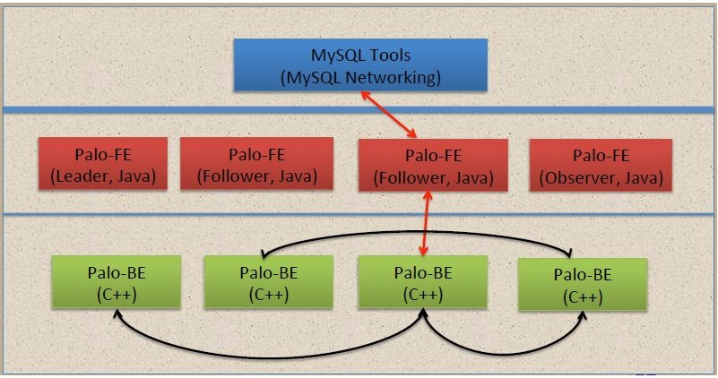

# 什么是云数据仓库 UDoris

云数据仓库UDW Doris为开源列式存储管理系统Doris提供了一整套高性能，高可用，极简运维，弹性伸缩的托管服务。UDoris是基于Apache Doris（Apache、Apache Doris 以及相关的开源产品的名称都归属于 Apache 软件基金会）的内核开发，分布式架构非常简洁，是基于MPP架构的分析型数据库，支持对海量数据进行高并发查询，并且可以支持10PB以上的超大数据集。适用于多种数据分析需求场景，例如BI报表分析，实时数据分析，交互式数据分析和探索式数据分析等。您可以在UCloud上便捷的购买UDoris，拥有一套Doris私有的集群。

### 产品架构

UDoris模块包括Frontend 和 Backend 两类，作用如下。

- Frontend是Doris的前端节点，以java语言为主，主要负责接受和返回客户端请求，元数据以及集群管理，查询计划生成等工作。

- Backend是Doris的后端节点，以C++语言为主，主要负责数据存储与管理、查询计划执行等工作。

### 产品特性

主要特性如下。

- 现代化MPP(大规模并行处理）架构的分析型数据库。
- 支持标准SQL语言，兼容MySQL协议。
- 极速SQL查询，全新的向量化执行引擎，亚秒级查询延时，单节点每秒可处理多达100亿行数据，综合查询速度比其他产品快10-100倍。
- 极简运维，弹性伸缩；Frontend节点和Backend节点都支持扩展，Frontend节点的扩容和缩容过程，不影响当前系统运行；Backend 节点的扩容和缩容过程，不影响当前系统的性能，数据均衡会自动进行。
- 高性能、高可用、高可靠；数据和元数据都默认使用3副本存储，在少数节点宕机的情况下，依然可以保证数据的可靠性。Doris 会自动检查和修复损坏的数据，并将请求自动路由到健康的节点，7*24 小时保证数据的可用性。

Doris官网地址，请参见https://doris.apache.org

Doris参考文档链接，请参见https://doris.apache.org/get-starting/get-starting.html

### 增强特性

UDoris面对企业级用户做了以下增强。

- 可视化监控：内存、CPU、磁盘监控等。

- 可扩展性：支持多规格配置选择、弹性垂直扩容。

