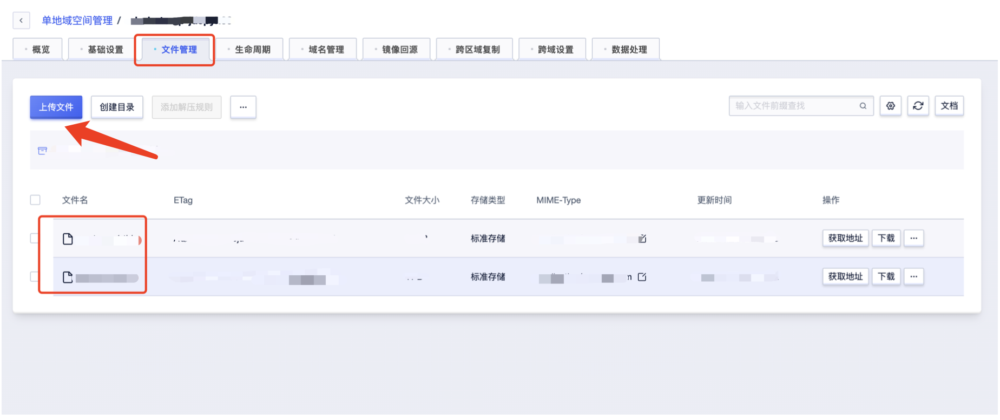

# US3 Load

从0.14 版本开始，Doris 支持通过 S3 协议直接从支持 S3 协议的在线存储系统导入数据。以下是US3导入数据的介绍。

## 使用场景

1. 源数据在 支持 S3 协议的存储系统中，如 S3,BOS 等。
2. 数据量在 几十到百 GB 级别。

## 准备工作

1. 登录UCloud账号进入到[用户控制台](https://passport.ucloud.cn/#login)，在全部产品下搜索或者大数据下选择"对象存储 US3"，进入到[US3控制台](https://console.ucloud.cn/ufile/ufile)下，点击**创建存储空间**按钮，地域选择需要和创建的udoris集群所在的地域一致。具体文档可参考：[对象存储US3文档](https://docs.ucloud.cn/ufile/README)

   

2. 上传需要导入的数据文件到US3

   

## 导入示例

在同一地域下的云主机上连接云数据仓库UDoris任一Frontend节点，执行以下命令。

    LOAD LABEL example_db.exmpale_label_1
    (
        DATA INFILE("s3://your_bucket_name/your_file.txt")
        INTO TABLE load_test
        COLUMNS TERMINATED BY ","
    )
    WITH S3
    (
        "AWS_ENDPOINT" = "AWS_ENDPOINT",
        "AWS_ACCESS_KEY" = "AWS_ACCESS_KEY",
        "AWS_SECRET_KEY"="AWS_SECRET_KEY",
        "AWS_REGION" = "AWS_REGION"
    )
    PROPERTIES
    (
        "timeout" = "3600",
        "exec_mem_limit" = "XXX"
    );

参数说明：

| 参数             | 描述                                                         |
| ---------------- | ------------------------------------------------------------ |
| example_db       | 需要导入数据的数据库名称                                     |
| exmpale_label_1  | 自定义的label名称，用于查看导入进度                          |
| your_bucket_name | us3的存储空间域名，又名Bucket名称，请查看上述准备工作中的第一步所示图 |
| your_file.txt    | 在us3上传成功的需要导入的文件名                              |
| load_test        | 需要导入的表名称                                             |
| terminated       | 导入数据的分隔符                                             |
| aws_endpoint     | 在us3中上传成功的需要导入的文件所在的域名。可在[接入域名文档中查询](https://docs.ucloud.cn/ufile/s3/s3_introduction) |
| aws_access_key   | 令牌公钥，[参考令牌管理文档](https://docs.ucloud.cn/ufile/guide/token) |
| aws_secret_key   | 令牌私钥，[参考令牌管理文档](https://docs.ucloud.cn/ufile/guide/token) |
| aws_region       | Bucket所属地域，[参考地域列表](https://docs.ucloud.cn/api/summary/regionlist) |
| properties       | 指定导入的相关参数。目前支持以下参数                         |
| timeout          | 导入超时时间。默认为 4 小时。单位秒                          |
| exec_mem_limit   | 导入内存限制。默认为 2GB。单位为字节。                       |
| max_filter_ratio | 最大容忍可过滤（数据不规范等原因）的数据比例。默认零容忍。取值范围为 0 到 1。 |
| strict_mode      | 是否对数据进行严格限制。默认为 false。                       |
| timezone         | 指定某些受时区影响的函数的时区，如 `strftime/alignment_timestamp/from_unixtime` 等 |

## 导入状态

实例所属于北京地域下导入100G的文件示例：

```
LOAD LABEL ssb.customer
(
    DATA INFILE("s3://xxx/customer.tbl")
    INTO TABLE customer
    COLUMNS TERMINATED BY "|"
)
WITH S3 (
    "AWS_ENDPOINT" = "http://internal.s3-cn-bj.ufileos.com",
    "AWS_ACCESS_KEY" = "XXX",
    "AWS_SECRET_KEY"="XXX",
    "AWS_REGION" = "cn-bj"
)
PROPERTIES
(
    "timeout" = "60",
    "exec_mem_limit" = "8589934592"
);
```

查看导入状态参考语法：show load \G;


取消导入参考语法：CANCEL LOAD FROM demo WHERE LABEL = "broker_load_name";


注：更多S3 Load参数请参考官网 [S3 Load文档](https://doris.apache.org/zh-CN/docs/data-operate/import/import-way/s3-load-manual)

​		更多US3参数及详细操作请参照[US3文档](https://docs.ucloud.cn/ufile/README)

