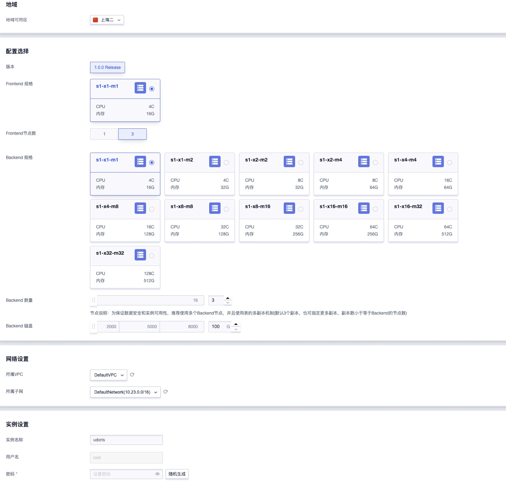
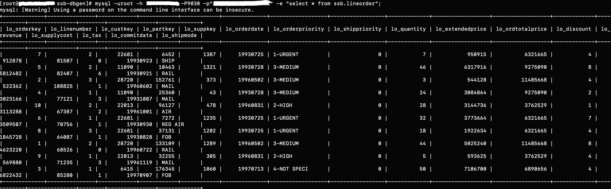

# 快速开始

## 创建集群
1.登录UCloud账号进入到[用户控制台](https://passport.ucloud.cn/#login)，在全部产品下搜索或者数据仓库下选择“数据仓库 UDW Doris”，进入到数据仓库 UDoris控制台下。


2.点击创建实例，进入集群创建页，按照实际需要根据页面提示，选择所需规格配置并购买。各配置项说明见配置说明。



#### 配置项说明

<table>
    <thead>
    <tr>
        <th>配置项</th>
        <th>说明</th>
    </tr>
    </thead>
    <tbody>
    <tr>
        <td>地域</td>
        <td>
            暂支持地域华北一、上海二、广州，建议按业务就近原则选择合适地域。
            <p class="tip">注意：一旦地域选定，购买成功后无法进行修改。</p>
        </td>
    </tr>
    <tr>
        <td>可用区</td>
        <td>不同可用区处于不同的地理区域，根据实际情况选择。</td>
    </tr>
    <tr>
        <td>版本</td>
        <td>按实际需要选择内核版本</td>
    </tr>
    <tr>
        <td>CPU/内存</td>
        <td>
            <blockquote>
                <ul>
                    <li>Frontend机型</li>
                    <li>4核16G</li>
                </ul>
                <ul>
                    <li>Backend机型</li>
                    <li>4核16G、4核32G、8核32G、8核64G、16核64G、16核128G、32核128G、32核256G、64核256G、64核512G、128核512G</li>
                </ul>
            </blockquote>
        </td>
    </tr>
    <tr>
        <td>节点个数</td>
        <td>Frontend支持单节点和3节点，3节点的集群具有高可用性。Backend节点最大支持16个，Frontend(3节点情况下)和Backend都默认3副本存储</td>
    </tr>
    <tr>
        <td>云盘容量</td>
        <td>集群默认云盘容量为100G，最大支持8000G，如存储数据量比较庞大，建议增加容量。</td>
    </tr>
    <tr>
        <td>网络</td>
        <td>
            VPC（Virtual Private Cloud）是属于用户的、逻辑隔离的网络环境。<br />
            各地域我们会创建默认VPC和默认子网，用户可直接将集群创建在默认VPC中
        </td>
    </tr>
    </tbody>
</table>


## 查看集群信息

集群创建并启动成功后，您可进入到数据仓库 UDoris控制台下，选择集群所在地域可用区后，可查看集群列表和详情信息。


## 使用云数据仓库UDoris

### 连接集群

- 在集群所在地域（同一网段）下建立一台云主机，在云主机上安装mysql-client，官方下载地址：[下载mysql-client](https://dev.mysql.com/downloads/mysql/)。

- 下载如下rpm包：

  ```
  mysql-community-client-5.7.26-1.el7.x86_64.rpm
  mysql-community-common-5.7.26-1.el7.x86_64.rpm
  mysql-community-libs-5.7.26-1.el7.x86_64.rpm
  ```
  
- 执行安装

  ```shell
  rpm -ivh mysql-community-common-5.7.26-1.el7.x86_64.rpm
  rpm -ivh mysql-community-libs-5.7.26-1.el7.x86_64.rpm
  rpm -ivh mysql-community-client-5.7.26-1.el7.x86_64.rpm
  ```

- 通过mysql-client连接集群

  ```shell
  mysql -uroot -h<任一frontend节点IP地址> -P9030 -p<创建集群时设置的密码>
  ```

  

  以上命令将进入交互模式。用户名默认root、端口默认9030，节点IP可到集群详情查看。

## 创建数据库及数据表

使用mysql-client进入交互模式连接集群执行DDL语句

- 建库建表

```sql
CREATE DATABASE IF NOT EXISTS ssb;
CREATE TABLE `lineorder` (
  `lo_orderkey` bigint(20) NOT NULL COMMENT "",
  `lo_linenumber` bigint(20) NOT NULL COMMENT "",
  `lo_custkey` int(11) NOT NULL COMMENT "",
  `lo_partkey` int(11) NOT NULL COMMENT "",
  `lo_suppkey` int(11) NOT NULL COMMENT "",
  `lo_orderdate` int(11) NOT NULL COMMENT "",
  `lo_orderpriority` varchar(16) NOT NULL COMMENT "",
  `lo_shippriority` int(11) NOT NULL COMMENT "",
  `lo_quantity` bigint(20) NOT NULL COMMENT "",
  `lo_extendedprice` bigint(20) NOT NULL COMMENT "",
  `lo_ordtotalprice` bigint(20) NOT NULL COMMENT "",
  `lo_discount` bigint(20) NOT NULL COMMENT "",
  `lo_revenue` bigint(20) NOT NULL COMMENT "",
  `lo_supplycost` bigint(20) NOT NULL COMMENT "",
  `lo_tax` bigint(20) NOT NULL COMMENT "",
  `lo_commitdate` bigint(20) NOT NULL COMMENT "",
  `lo_shipmode` varchar(11) NOT NULL COMMENT ""
)
PARTITION BY RANGE(`lo_orderdate`)
(PARTITION p1992 VALUES [("-2147483648"), ("19930101")),
PARTITION p1993 VALUES [("19930101"), ("19940101")),
PARTITION p1994 VALUES [("19940101"), ("19950101")),
PARTITION p1995 VALUES [("19950101"), ("19960101")),
PARTITION p1996 VALUES [("19960101"), ("19970101")),
PARTITION p1997 VALUES [("19970101"), ("19980101")),
PARTITION p1998 VALUES [("19980101"), ("19990101")))
DISTRIBUTED BY HASH(`lo_orderkey`) BUCKETS 10
PROPERTIES (
"replication_num" = "3"
);
```


## 准备数据并导入

创建csv文件lineorder.csv放到之前创建的云主机数据盘/data目录下

```
1|2|28720|133109|1289|19960502|3-MEDIUM|0|44|5025240|11485668|8|4623220|68526|0|19960722|RAIL
2|3|28720|152761|373|19960502|3-MEDIUM|0|3|544128|11485668|4|522362|108825|1|19960602|MAIL
3|1|6415|176345|1060|19970713|4-NOT SPECI|0|50|7106700|6890656|4|6822432|85280|1|19970907|FOB
4|1|11090|25360|43|19930728|3-MEDIUM|0|24|3084864|9275090|2|3023166|77121|3|19931007|MAIL
5|2|11090|10463|1321|19930728|3-MEDIUM|0|46|6317916|9275090|8|5812482|82407|6|19930921|RAIL
6|1|22681|7272|1235|19930725|1-URGENT|0|32|3773664|6321665|7|3509507|70756|1|19930930|REG AIR
7|2|22681|6452|1387|19930725|1-URGENT|0|7|950915|6321665|4|912878|81507|0|19930923|SHIP
8|3|22681|37131|1202|19930725|1-URGENT|0|18|1922634|6321665|4|1845728|64087|1|19930828|FOB
9|1|22013|32255|305|19960831|2-HIGH|0|5|593625|3762529|4|569880|71235|3|19961119|MAIL
10|2|22013|96127|478|19960831|2-HIGH|0|28|3144736|3762529|1|3113288|67387|2|19961001|AIR
```

使用Stream load命令导入数据

```shell
curl --location-trusted -u root:<创建集群时设置的密码> -H "column_separator:|" -T /data/lineorder.csv http://<任一Frontend节点IP地址>:8030/api/ssb/lineorder/_stream_load
```

## 查询数据

- 使用mysql-client非交互模式

  ```
  mysql -uroot -h<任一Frontend节点IP地址> -P9030 -p<创建集群时设置的密码> -e "select * from ssb.lineorder";
  ```




