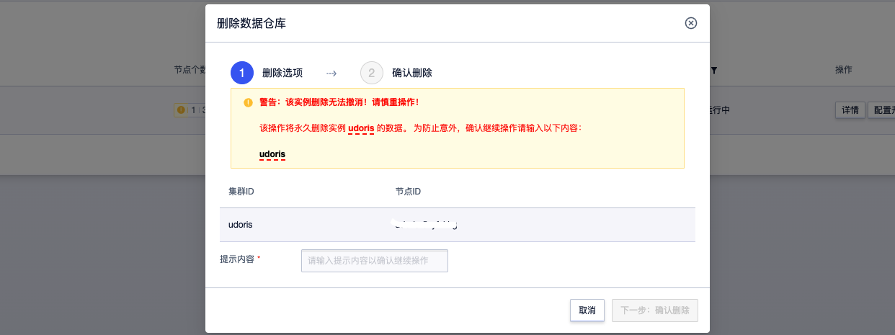

# 删除数据仓库

登录UCloud账号进入到[用户控制台](https://passport.ucloud.cn/#login)，在全部产品下搜索或者数据仓库下选择“数据仓库 UDW Doris”，进入到[数据仓库UDoris控制台](https://console.ucloud.cn/udw/doris)下，选择 **操作 -> 删除**

  注意：删除集群为高危操作，请您在删除前做好业务变更及数据备份！集群删除无法撤销，且集群数据将永久删除。

