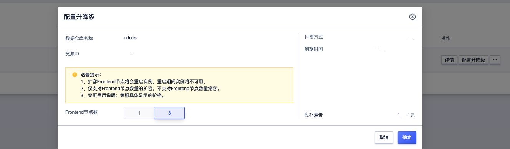

# 配置升降级

当您创建集群选择的是单Frontend节点时，当前集群的性能已经满足不了实际需求时，云数据仓库 UDW Apache Doris提供了Frontend节点扩容到高可用节点。

<blockquote>
温馨提示：
  <ol>
  <li>正常Frontend节点扩容不影响集群正常的使用，但是数据量大时，由于doris后台任务会自动同步数据，为避免出现问题，请选择在业务低峰期进行升级</li>
  <li>如果您的集群已经是高可用版本，无需再扩容，则当前按钮不可用</li>
  </ol>
</blockquote>

1. 登录UCloud账号进入到[用户控制台](https://passport.ucloud.cn/#login)，在全部产品下搜索或者数据仓库下选择“数据仓库UDW Apache Doris”，进入到[数据仓库 UDW Apache Doris控制台](https://console.ucloud.cn/udw/doris)下，在列表中选择**操作 -> Frontend节点扩容**。

2. 在集群升级弹窗页，选择扩容到高可用节点。

<blockquote>
  温馨提示：节点只可以扩容不能缩容。
</blockquote>

3. 单击**确定**，进入到订单确认页完成订单支付后，集群将变为**改配中**持续数分钟后完成升级。