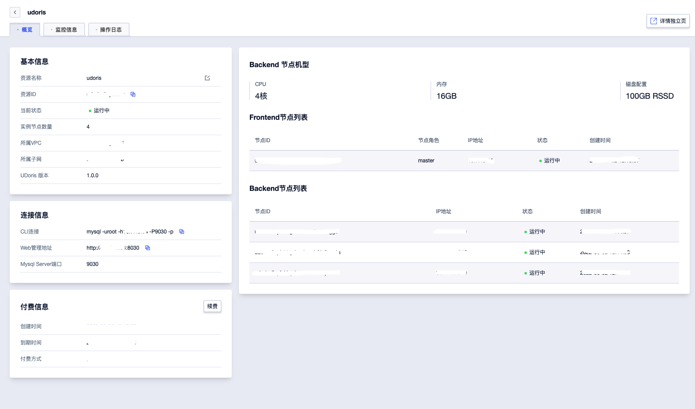
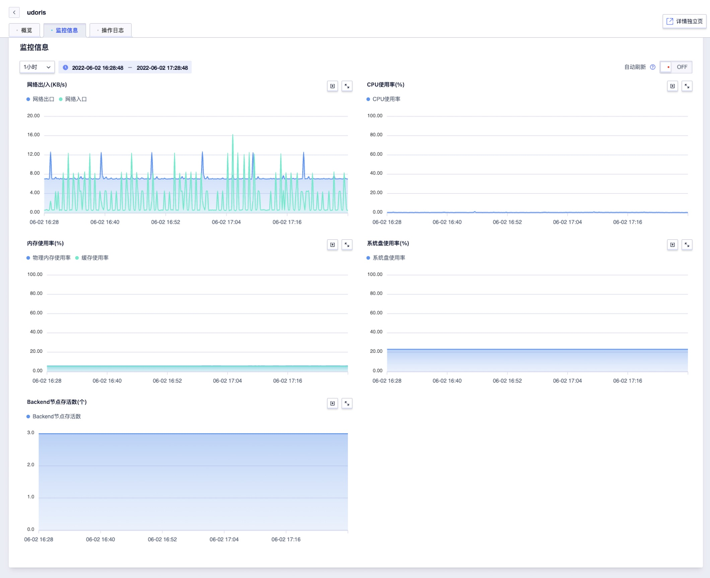
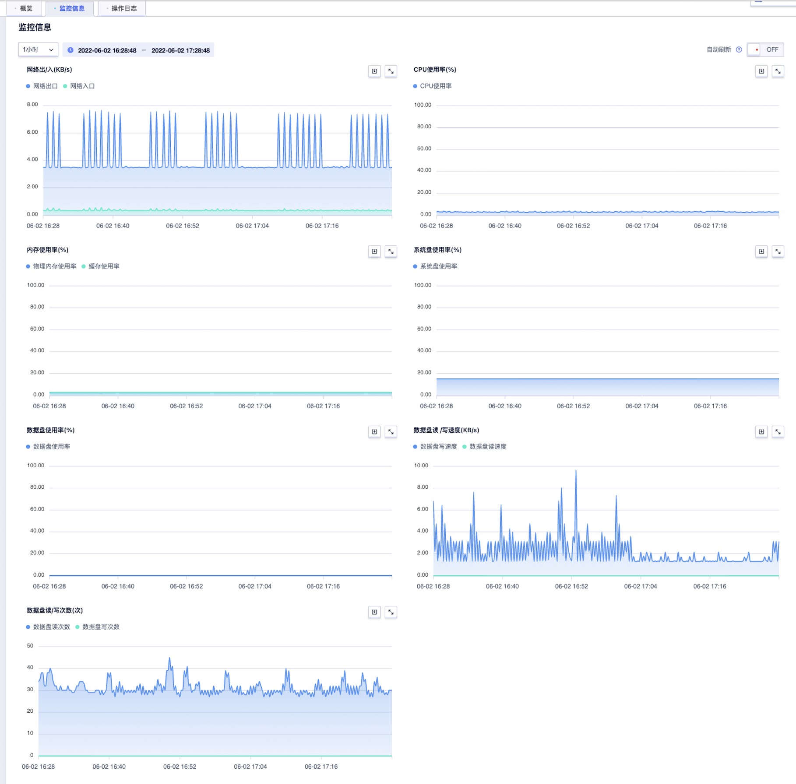
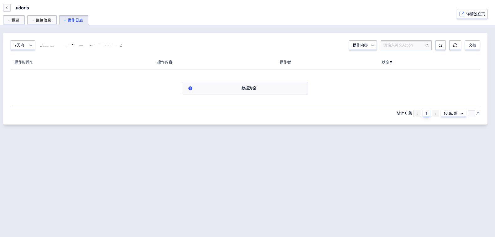

# 管理集群

## 新建集群

登录UCloud账号进入到[用户控制台](https://passport.ucloud.cn/#login)，在全部产品下搜索或者数据仓库下选择“数据仓库 UDW Doris”，进入到 [数据仓库 UDW Apache Doris控制台下](https://console.ucloud.cn/udw/doris)，点击**创建集群**按钮。进入创建实例页面，根据创建页提供的配置进行选择并下单。具体请参考[快速上手](/udoris/gettingstart)。

## 查看集群详情

当集群创建并运行后，您可进入 [数据仓库 UDW Apache Doris控制台](https://console.ucloud.cn/udw/doris)，在实例列表，点击**详情**按钮，即可打开集群详情页。

- 概览：可以查看基本信息、连接信息、付费信息、机型信息、节点信息。

  

## 查看监控信息

在集群详情抽屉页切换到**监控信息**，可以查看集群各节点的监控指标。

## 查看操作日志

在集群详情抽屉页切换到**操作日志**，可以查看并追溯您的操作记录。

