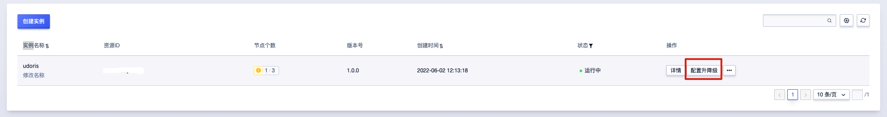
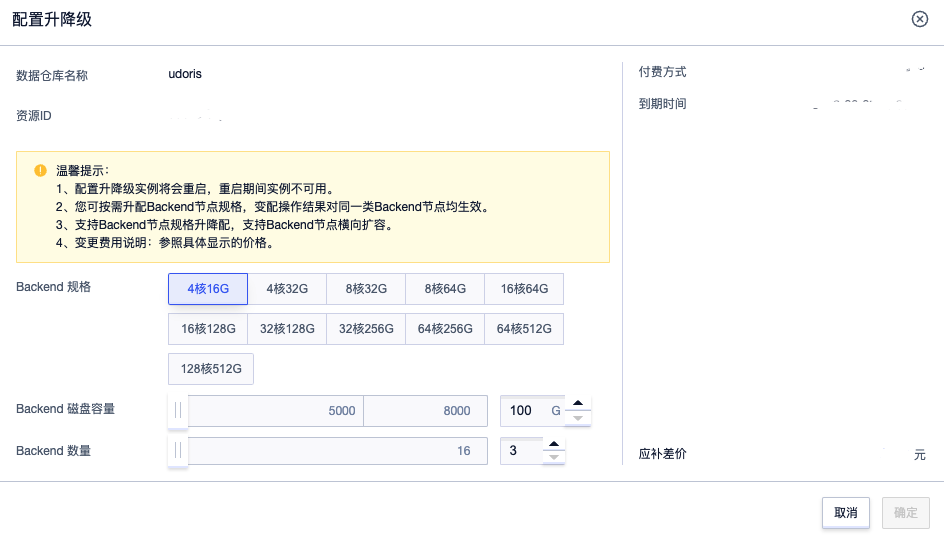

# 配置升降级

当您当前集群的规模及配置已经满足不了实际需求时，云数据仓库UDW Apache Doris提供了Backend配置升级功能，帮助您完成集群的CPU内存、节点、磁盘的升级调整。

<blockquote>
温馨提示：
  <ol>
  <li>当集群处于运行中时才可进行配置升级</li>
    <li>配置升级时集群处于不可用状态，需要稍等几分钟，请选择在业务低峰期进行升级</li>
  </ol>
</blockquote>

1. 登录UCloud账号进入到[用户控制台](https://passport.ucloud.cn/#login)，在全部产品下搜索或者数据仓库下选择“数据仓库 UDW Apache Doris”，进入到[数据仓库 UDW Apache Doris控制台](https://console.ucloud.cn/udw/doris)下，在列表中选择**操作 -> 配置升降级**。

​     

2. 在集群升级弹窗页，选择需要变更的配置项。

<blockquote>
  温馨提示：支持节点机型、磁盘和节点的同时升级，注意磁盘和节点只可以扩容不能缩容。
</blockquote>

3. 单击**确定**，进入到订单确认页完成订单支付后，集群将变为**改配中**持续数分钟后完成升级。

