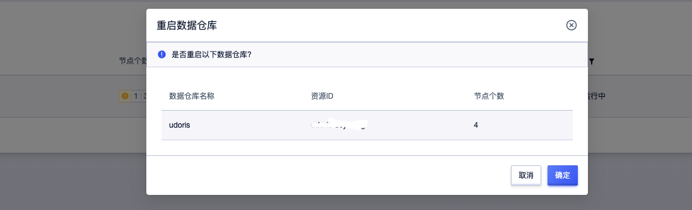

# 重启集群

当您需要重启集群时，登录UCloud账号进入到[用户控制台](https://passport.ucloud.cn/#login)，在全部产品下搜索或者数据仓库下选择“数据仓库 UDW Doris”，进入到[数据仓库UDoris控制台](https://console.ucloud.cn/udw/doris)下，选择 **操作 -> 重启**

  注意：重启集群为高危操作，集群将处于重启中持续数秒，建议无必要时不要随意重启实例，这将会影响您的业务。

